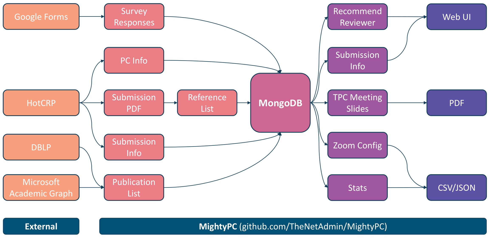

# MightyPC - Mighty toolkit for conference Program Chairs

This is a toolkit for conference program chairs to manage submissions, assign
reviewers and organize TPC meetings. It currently only works with HotCRP.

MightyPC is written in Python and R. Most of its functionalities are tested on
both Linux and Windows. MacOS is not tested but should work fine.

Currently it does not come with thorough documentation, you may check the existing
comments and READMEs under each directory, or directly read the code. We may add
more docs and examples in the future.

MightyPC is initially developed for [MICRO 2021](https://www.microarch.org/micro54),
with internal code name *PowerPC* (Powerful toolkit for conference Program Chair).

MightyPC has already served in MICRO 2021 and HPCA 2022.

## Overview

## Introduction

This toolkit can:

1. Parse DBLP
2. Parse Microsoft Academic Graph database
3. Maintain a MongoDB for agile development and centralized data storage
4. Parse reference list given a submission pdf
5. Suggest reviewers based on pc papers cited by a submission
6. Generate TPC meeting zoom configurations
7. Generate TPC meeting slides to show conflicts for each discussion
8. And many more

This toolkit currently does not provide the following functionalities, they may
be implemented later:

   1. Conflict check

      > - Although conflict check with DBLP and MAG records in MongoDB should be
      a trivial job (because all publication info for each pc member are already
      in MongoDB), but I was not responsible for the conflict check during
      MICRO 2021, so I have not implemented this functionality.
      > - I may (or may not) implement conflict check in the future
      > - You may check `MongoDB/conflict.py` for a very naive conflict check
      that makes sure every author of a submission is defined as a conflict,
      this may serve as a start point
      > - If you implement this functionality, we would highly appreciate if you
      can open a Pull Request

## License

This project is open sourced under MIT license.
